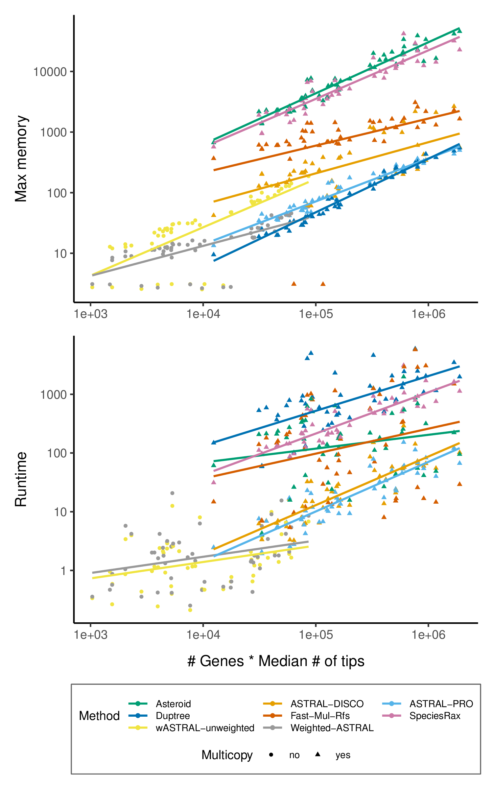

# PhylomeDB species tree reconstruction pipeline v 0.0.1

## Download data

First, you need to download all phylomedb useful data to run the pipeline. This means the besttrees, aln and info file.

To do this you just need to add the ids you are interested in to `data/ids/phy_ids.txt`

And then run:

`snakemake -s pipeline/download_data.smk -p -c2`

After this completed successfully you can go forward. **NOTE:** Do this step in mn0 or in a mounted folder as you need internet!

You can see phylome ids, seed species and description in this file:  [PhylomeDB.csv](data/info/PhylomeDB.csv) (Downloaded: 20/6/23).

## Usage


The pipeline takes the data previously downloaded, parse them and apply 8 different summary species tree reconstruction methods: see [methods](data/info/methods.csv)

After all 8 trees are computed you can get a consensus tree with support computed as `% of methods agreeing/gCF/sCF`. [Gene concordance factor and site conconrdance factor](http://www.iqtree.org/doc/Concordance-Factor) are computed with single copy gene trees with minimum occupancy of 10% (by default, it can be set in this [config file](data/configs/pdb_config.yml))

## MareNostrum

```
#!/bin/bash    
#SBATCH --job-name=pdb_sp
#SBATCH --output=logs/pdb_sp.out
#SBATCH --error=logs/pdb_sp.err
#SBATCH --cpus-per-task=48
#SBATCH --time=2:00:00

#SBATCH --qos=debug
#SBATCH --constraint=highmem

module load ANACONDA/2022.10
conda activate snakemake

ulimit -s 2000000
snakemake -s pipelines/sptree_reconstruction.smk --unlock
snakemake -p -s pipelines/sptree_reconstruction.smk --cores 48 --printshellcmds --rerun-incomplete --keep-going
```

## Outputs


## Runtimes

These are the runtimes for some test phylomes:




### TODO

* mp-est (requires rooted gene trees)
* NJst, metal, steac, star from phybase package
* compare patristic distance and correlation

* if species not in single copy alignment scf fails
* option to root with species2age
* discovista similar stuff to visualize gene tree discordances and different species trees discordance
* phylter, treeshrink to detect outliers
* plot and filter gene trees based on exploratory statistics
* tree space analysis

* add sources to methods.csv
* benchmark qfo
* ideally split rules in parsing and runtimes to get the right runtimes
