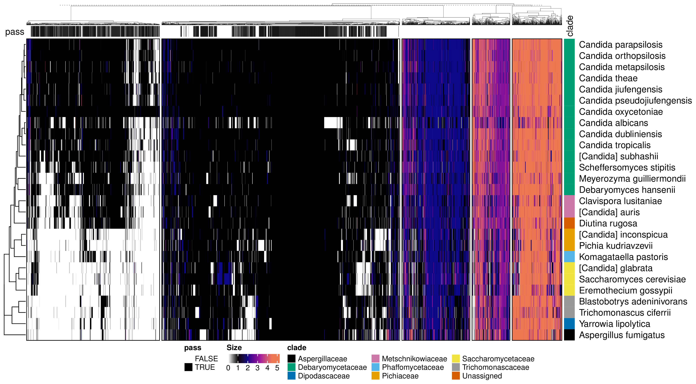

# PhylomeDB species tree reconstruction pipeline v 0.0.1

## Download data

First, you need to download all phylomedb useful data to run the pipeline. This means the besttrees, aln and info file.

To do this you just need to add the ids you are interested in to `data/ids/phy_ids.txt`

And then run:

`snakemake -s pipeline/download_data.smk -p -c2 -k`

After this completed successfully you can go forward. **NOTE:** Do this step in mn0 or in a mounted folder as you need internet!

You can see phylome ids, seed species and description in this file:  [PhylomeDB.csv](data/info/PhylomeDB.csv) (Downloaded: 20/6/23).

### Data Errors

**NOTE:** Some phylomes have weird alignment or tree files, the pipeline should manage to identify the weird ones, add the ids in `data/info/failed_download.ids` and avoid adding the id in the sptree reconstruction pipeline untile the data issue has been resolved. This is the reason of the `-k --keep-going` option. Further, some phylomes may have single copy gene trees that do not cover all the species, in also this case the download pipeline will fail and the phylome id would be added in the failed ids file and not considered further. After the pipeline has run you can check if the failed phylome ids are in download and the species tree pipeline with: `comm -12 data/info/failed_download.ids data/ids/phy_ids.txt` and `comm -12 data/info/failed_download.ids data/ids/phy_ids_download.txt`. If there are some, remove them as those will require specific evaluation.

These are the errors found in PhylomeDB:

* Corrupted FTP files, if there are less alignments than trees exit. This may be very severe and if we check for the single copy genes that also have alignments we could go ahead. However, the alignments should be somewhere as we have the tree so it could be solved at the root one day.
* Single copy gene trees do not have all the species therefore the single copy methods will have less species than the others and no consensus tree can be computerd.


## Methods

| method        | multicopy | branch_lengths | branch_support       | root | source                                                                         |
| ------------- | --------- | -------------- | -------------------- | ---- | ------------------------------------------------------------------------------ |
| duptree       | yes       | no             | no                   | yes  | https://doi.org/10.1093/bioinformatics/btn230                                  |
| astral        | no        | CU             | localPP              | no   | https://doi.org/10.1186/s12859-018-2129-y |
| W-astral      | no        | CU             | localPP              | no   | https://doi.org/10.1093/molbev/msac215                                         |
| Astral-DISCO  | yes       | CU             | localPP              | no   | https://doi.org/10.1093/sysbio/syab070                                         |
| Astral-PRO    | yes       | CU             | localPP              | no   | https://doi.org/10.1093/bioinformatics/btac620                                 |
| SpeciesRax    | yes       | sub/site       | EQPIC score          | yes  | https://doi.org/10.1093/molbev/msab365                                         |
| Fast-Mul-Rfs  | yes       | ?              | no                   | no   | https://doi.org/10.1093/bioinformatics/btaa444                                 |
| Asteroid      | yes       | distance       | bootstrap from input | no   | https://doi.org/10.1093/bioinformatics/btac832                                 |
| Concatenation | yes/no    | sub/site       | bootstrap,gCF,sCF    | no   |                                                                                |

Possible additions:

* mp-est (requires rooted single copy gene trees in nexus formats)
* NJst, metal, steac, star from phybase package


## Usage


The pipeline takes the data previously downloaded, parse them and apply 8 different summary species tree reconstruction methods: see [methods](data/info/methods.csv)

After all 8 trees are computed you can get a consensus tree with support computed as `% of methods agreeing/gCF/sCF`. [Gene concordance factor and site conconrdance factor](http://www.iqtree.org/doc/Concordance-Factor) are computed with single copy gene trees with minimum occupancy of 10% (by default, it can be set in this [config file](data/configs/pdb_config.yml))

## MareNostrum

Highmem is usually better as sometimes fastmulrfs and asteroid may fail due to memory issues.

```
#!/bin/bash    
#SBATCH --job-name=pdb_sp
#SBATCH --output=logs/pdb_sp.out
#SBATCH --error=logs/pdb_sp.err
#SBATCH --cpus-per-task=48
#SBATCH --time=2:00:00

#SBATCH --qos=debug
#SBATCH --constraint=highmem

module load ANACONDA/2022.10
conda activate snakemake

ulimit -s 2000000
snakemake -s pipelines/sptree_reconstruction.smk --unlock
snakemake -p -s pipelines/sptree_reconstruction.smk --cores 48 --printshellcmds --rerun-incomplete --keep-going
Rscripts scripts/get_results.R
```

## Outputs

*note to self:* Run ./scripts/get_examples.sh to regenerate these plots when something changes.

Let's take for example phylome 960:

### All trees


### Species tree


### Densitree


### RF matrix


### Occupancy matrix



## Runtimes

These are the runtimes for some test phylomes:

<div align="center">


<\div>


### Notes

if error cran repo 
```
options(repos = c(CRAN = "http://cran.rstudio.com"))
```
if weird error pthreads  
```
export OMP_NUM_THREADS=1
export USE_SIMPLE_THREADED_LEVEL3=1
```

### TODO

* Check if other reason aln tar or tree file could be weird!
* option to root with species2age
* plot and filter gene trees based on exploratory statistics
* if method fails go ahead and use less than 8 tree
* compare patristic distance and correlation
* discovista similar stuff to visualize gene tree discordances and different species trees discordance
* tree space analysis
* benchmark qfo
* ideally split rules in parsing and runtimes to get the right runtimes
* installation of tools

